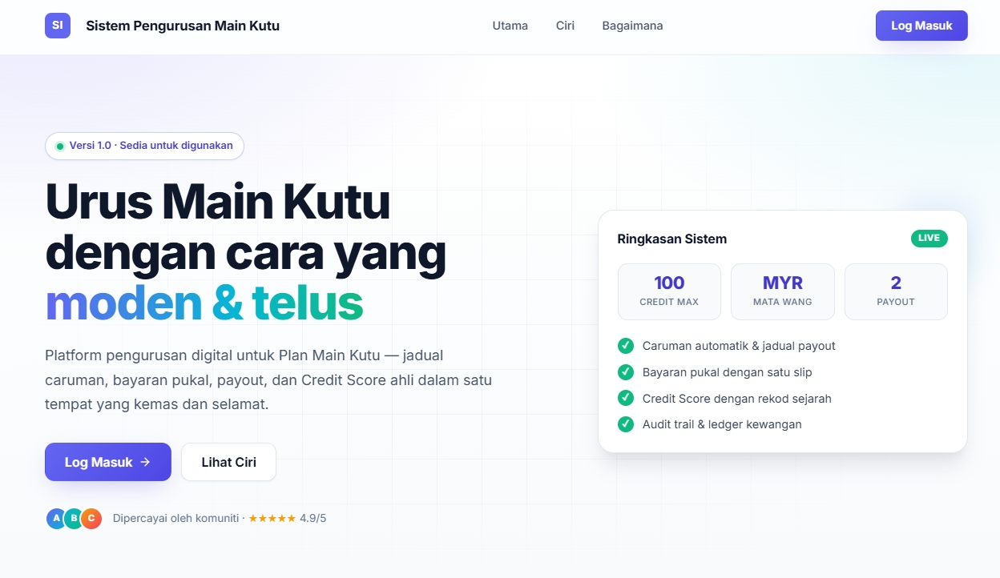
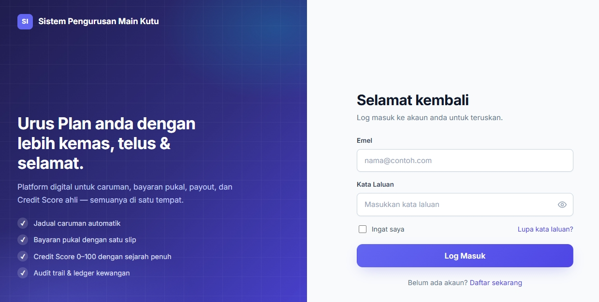
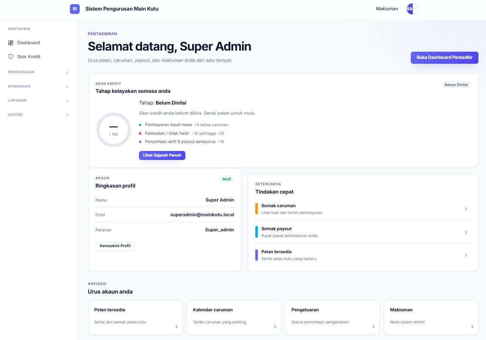
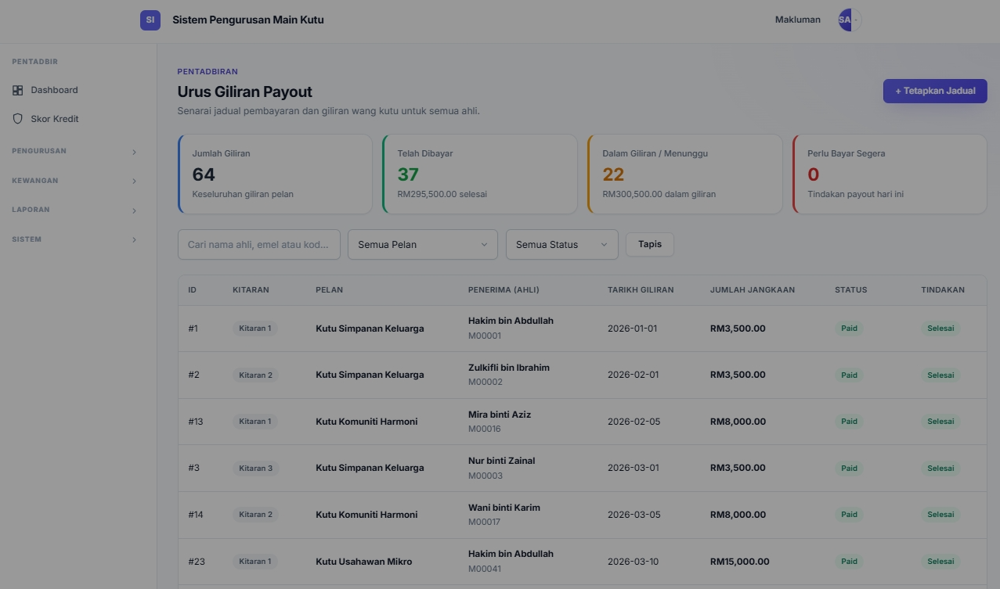

# Sistem Pengurusan Main Kutu

Aplikasi web untuk mengurus pelan Main Kutu secara digital — pembayaran, payout, jadual kitaran, pengesahan resit, skor kredit, dan laporan kewangan.

- **Stack:** Vanilla PHP 8.1+, MySQL / MariaDB, Apache
- **Frontend:** Tailwind CSS, Inter font, vanilla JS
- **Hosting:** cPanel / shared hosting compatible
- **Locale:** Bahasa Melayu (ms)

---

## Ciri Utama

- Pengurusan pelan (fixed / progressive / multiplier payout mode)
- Keahlian, jadual kitaran, jadual sumbangan & payout
- Bayaran perseorangan & pukal dengan muat naik resit
- Pengesahan bayaran, lejar (ledger), skor kredit automatik
- Payout, caj pentadbir, withdrawal, shortfall
- Kalendar, notifikasi, laporan kewangan
- Sandaran & pulihkan pangkalan data (Super Admin sahaja)
- Pengesahan CAPTCHA, dasar kunci akaun, audit log

---

## Tangkapan Skrin & Antara Muka

Beberapa paparan utama sistem untuk memberi gambaran pantas tentang aliran kerja pentadbir dan ahli.

### Halaman Utama (Landing Page)

Paparan pertama yang dilihat oleh pelawat — menonjolkan nilai teras sistem, ringkasan mata wang & had kredit, serta penarafan kepercayaan untuk membina keyakinan sebelum mendaftar.



*Laman utama dengan slogan "Urus Main Kutu dengan cara yang moden & telus", kad ringkasan sistem (100 CREDIT MAX, MYR MATA WANG, 2 PAYOUT) dan penarafan 4.9/5.*

### Log Masuk

Skrin log masuk mengandungi borang log masuk dengan emel & kata laluan.




### Dashboard Pentadbir

Papan pemuka untuk Super Admin — menunjukkan profil ringkasan (nama, emel, peranan), status skor kredit (Tahap: Belum Dinilai / 100), tindakan pantas (Semak caruman, Semak payout, Pelan tersedia) dan kad navigasi ke modul utama.



*Dashboard Super Admin dengan ringkasan akaun, skor kredit, tindakan pantas dan pintasan ke pelan, kalendar, payout & makluman.*

### Pengurusan Pelan (Plan Pakej)

Modul pengurusan pelan Main Kutu — jadual memaparkan semua pelan aktif dengan kod unik (contoh: KUTU-2026-W), nama pelan, jumlah caruman, kitaran, bilangan ahli, status dan tindakan (lihat/edit/padam).


*Senarai 6 pelan aktif (KUTU-2026-W hingga KUTU-2026-A) dengan statistik caruman, ahli dan status.*

### Urus Giliran Payout

Modul payout untuk mengurus giliran pembayaran balik kepada ahli — memaparkan kad ringkasan (Jumlah Giliran: 64, Telah Dibayar: 37, Menunggu: 22, Perlu Bayar Segera: 0) dan jadual terperinci setiap giliran.



*Halaman "Urus Giliran Payout" dengan statistik giliran dan jadual pembayaran mengikut kitaran pelan.*

### Pengurusan Bayaran & Pengesahan

Modul pengesahan bayaran ahli — statistik keseluruhan (1,475 jumlah transaksi, 87 menunggu, 1,384 diluluskan, 4 ditolak) dan jadual resit dengan tindakan lulus/tolak.


*Halaman "Pengurusan Bayaran & Pengesahan" dengan KPI transaksi dan senarai resit yang perlu disemak.*

### Skor Kredit & Risiko Ahli

Penilaian kredit automatik untuk setiap ahli — senarai ahli dengan skor 0–100, tahap risiko (Belum Dinilai / Low risk / High risk) dan sejarah pembayaran untuk membantu pentadbir membuat keputusan payout.


*Halaman "Skor Kredit Ahli" memaparkan senarai ahli berserta skor kredit dan label risiko terkini.*

---

## Pemasangan (cPanel / Shared Hosting)

### Wizard Web (disyorkan)

1. Muat naik projek ke `public_html/` di akaun cPanel anda.
2. Tetapkan *document root* domain ke subfolder `public_html/public/`.
3. Cipta pangkalan data + pengguna MySQL di *cPanel → MySQL® Databases*.
4. Layari `https://yourdomain.com/install.php` dan ikut 4 langkah:
   - Sambutan (semakan keperluan)
   - Konfigurasi pangkalan data & aplikasi
   - Sahkan + tetapkan akaun **Super Admin**
   - Selesai
5. **Padam** `install.php` dan `install-cli.php` dari server selepas siap.

Wizard akan:
- Menguji sambungan MySQL.
- Menulis `.env` (chmod 0600) dengan nilai yang dipilih.
- Menjalankan semua migration (`database/migrations/*.sql`).
- Menjalankan semua seeder (`database/seeders/*.sql`).
- Menjana data demo pilihan (2 pelan contoh).
- Mencipta / mengemas kini akaun Super Admin.
- Menulis `storage/installed.lock` untuk mengelakkan pasang semula tanpa sengaja.

### Wizard CLI (SSH)

```bash
php install-cli.php \
  --db-host=localhost --db-port=3306 \
  --db-name=kutu_main --db-user=kutu_user --db-pass='secret' \
  --app-url=https://kutu.example.com \
  --admin-name='Admin' --admin-email=admin@example.com \
  --admin-password='Secret123!' \
  --seed-demo
```

Pilihan berguna: `--force`, `--no-seed`, `--no-admin`, `--app-env=local`.

### Manual (tanpa wizard)

```bash
cp public_html/.env.example public_html/.env
# Edit .env: DB_*, APP_URL, SESSION_*
php public_html/cron/migrate.php
php public_html/cron/seed.php
```

---

## Akaun Lalai (Seeder)

Selepas `cron/seed.php` dijalankan, dua akaun demo dicipta dengan `must_reset_password = 1`:

| Emel | Peranan |
|------|---------|
| `admin@mainkutu.local` | Admin |
| `member@mainkutu.local` | Member |

> **Kata laluan dijana secara rawak** pada setiap seed dan disimpan sekali di
> `storage/logs/seed-credentials-<timestamp>-<rand>.log` (chmod 0600, di luar
> repo). Sebaik sahaja pengguna melengkapkan reset paksa pada log masuk
> pertama, kata laluan ini tidak lagi sah.
>
> Untuk persekitaran production, gunakan wizard pemasangan untuk mencipta
> akaun Super Admin dengan emel & kata laluan anda sendiri — seeder demo
> tidak diperlukan.

### Reset Kata Laluan

Sistem menguatkuasakan reset kata laluan dalam dua senario:

1. **Log masuk pertama** — Akaun yang baru dicipta akan ada `must_reset_password = 1`. Selepas login, pengguna di-redirect ke `/reset-password`.
2. **Reset oleh Admin** — Admin boleh reset kata laluan ahli melalui panel. Sistem menjana kata laluan sementara dan/atau menghantar token reset.

Selepas berjaya reset, flag `must_reset_password` dipadamkan dan kata laluan di-hash semula dengan bcrypt (cost ≥ 10).

---

## Docker Desktop (Pembangunan)

### Keperluan

- Docker Desktop untuk Windows / Mac / Linux
- Docker Compose (sudah termasuk dalam Docker Desktop)

### Arahan

```powershell
docker-compose up --build -d
docker exec mainkutu_app php /var/www/html/cron/migrate.php
docker exec mainkutu_app php /var/www/html/cron/seed.php
```

- Aplikasi: `http://localhost:8090`
- phpMyAdmin: `http://localhost:8091` (user `root` / pass `root_password`)

Hentikan:

```powershell
docker-compose down          # kekalkan data
docker-compose down -v       # padam data + volume
```

---

## Konfigurasi

Salin `.env.example` ke `.env` dan kemas kini nilai mengikut persekitaran:

```bash
cp public_html/.env.example public_html/.env
```

Kunci penting:

| Pembolehubah | Tujuan |
|--------------|--------|
| `APP_ENV` | `production` atau `local` |
| `APP_URL` | URL asas aplikasi (digunakan untuk redirect) |
| `DB_*` | Hos, port, nama DB, pengguna, kata laluan, charset |
| `SESSION_SECURE` | `true` jika HTTPS, `false` jika HTTP |
| `MAX_UPLOAD_SIZE_MB` | Had saiz muat naik resit |
| `AUTH_MAX_FAILED_ATTEMPTS` / `AUTH_LOCKOUT_SECONDS` | Had percubaan log masuk & tempoh kunci |
| `CURRENCY` / `CURRENCY_SYMBOL` | Paparan mata wang |

---

## Keselamatan

- **Prepared statements** melalui PDO untuk semua query (tiada concatenation SQL).
- **bcrypt** untuk hash kata laluan (cost 10).
- **CSRF token** untuk semua bentuk POST.
- **Session hardening** — HttpOnly, SameSite, Secure (apabila HTTPS), `use_strict_mode`.
- **Captcha** boleh didayakan dalam tetapan sistem.
- **Rate limiting / lockout** untuk log masuk gagal.
- **Audit log** untuk tindakan sensitif (reset, import, export, pengubahsuaian peranan).
- **Super admin gating** untuk tindakan merosakkan (reset pangkalan data, import, export).
- **.htaccess** menyekat akses terus ke `.env`, `install*.php`, `composer.*`, `README.md`.
- **OPcache** sangat disyorkan pada production — aktifkan `opcache.enable=1`, `opcache.jit=tracing`.

---

## Prestasi

Disyorkan untuk production:

```ini
# php.ini
opcache.enable=1
opcache.memory_consumption=128
opcache.max_accelerated_files=10000
opcache.jit=tracing
opcache.jit_buffer_size=64M
```

Apache modules didayakan: `mod_rewrite`, `mod_deflate`, `mod_expires`, `mod_headers`.

Migration [008_perf_indexes.sql](file:///c:/Users/home/Documents/Github-project/Sistem_Main_Kutu/public_html/database/migrations/008_perf_indexes.sql) menambah indeks untuk lajur yang kerap ditapis (`app_settings.key`, `users.email`, `payments.member_id`, dsb.).

---

## Cron Jobs

| Skrip | Tujuan | Cadangan Jadual |
|-------|--------|-----------------|
| `cron/daily.php` | Tanda jadual tertunggak, notifikasi, skor kredit, flag payout due | Harian (00:05) |
| `cron/migrate.php` | Jalankan SQL migrations yang belum dilaksana | Manual / deploy |
| `cron/seed.php` | Jana akaun demo dengan kata laluan rawak | Manual sahaja |
| `install-cli.php` | Wizard pemasangan CLI | Sekali / persekitaran baru |

Contoh crontab:

```
5 0 * * * php /var/www/html/cron/daily.php >> /var/www/html/storage/logs/cron.log 2>&1
```

Ujian manual dalam Docker:

```powershell
docker exec mainkutu_app php /var/www/html/cron/daily.php
```

---

## Status Pembangunan

Fasa 1 — Project Foundation ✅
Fasa 2 — Authentication & Password Reset ✅
Fasa 3 — Pelan Kutu & Keahlian ✅
Fasa 4 — Bayaran & Pengesahan ✅
Fasa 5 — Payout, Admin Fee, Withdrawal, Shortfall, Laporan, Kalendar, Notifikasi ✅
Fasa 6 — Sandaran & Pulihkan Pangkalan Data ✅
Fasa 7 — Wizard Pemasangan cPanel ✅

---

## Lesen

OpenSource
